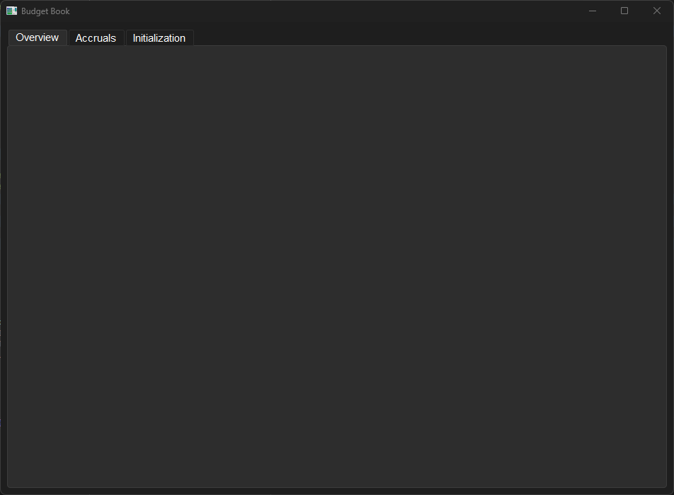
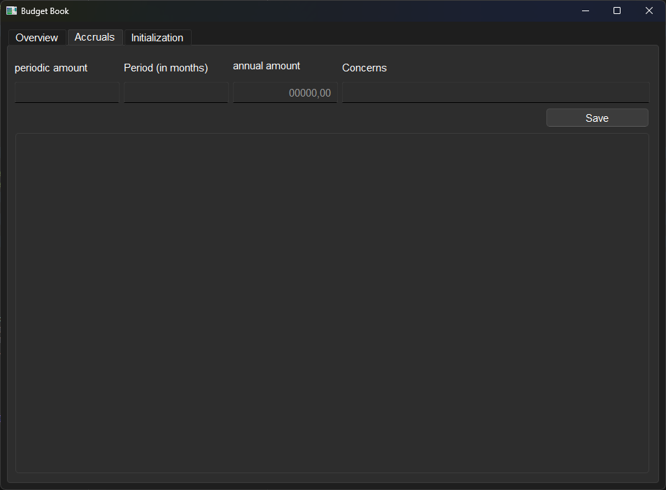
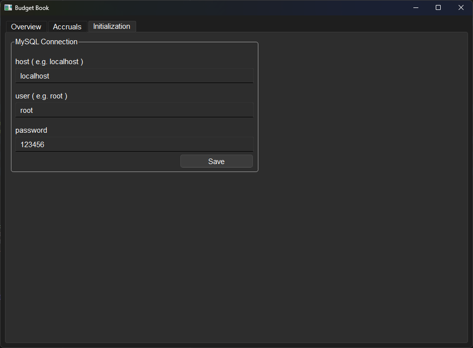

## Content
- [Reason](#reason)
- [current status](#current-status)
- [Description](#description)    
- [User Interface](#user-interface)
- [Licence](#licence)
- [Requirements](#requirements)

## Reason

This is a ongoing project to develop my Python and SQL coding skills in one big project. Feel free to download an adjust the script for personal use.  
This here will be a holostic BudgetBook solution for privat money management.  
for any questions on this feel free to contact me via LinkedIn.  

## current status

update 25.08.2024
 - created the accruals tab (not functional now)
 - prepared accruals table for first processes
 - deleted database information from UI and added them to the DBConnection init
 - updated README.md with description and pictures

update 22.08.2024  
 - created Classes Procedure() and DBConnection() in BudgetBook.py
 - reorganized procedures in BudgetBook.py 
 - reorganized commentary for better understanding

update 16.08.2024  
 - BudgetBook.py starts the userInterface  
 - It checks a connection to the MySQL Server is possible.  
 - If connection possible: it  checks for database and tables. if not existing, it creates whatever is missing.  
 - Server connection can be managed in Settings. "Save" will start the checking und creation process.   

## Description

### Overview

The Overview is just an empty page now. Later on here will be a dashboard shown with several information about the account.    
    

### Accruals

The accruals are a list of expenses that occur periodically. Like an Insurance that is paid annualy. The period and the periodic ammount can be added and the system will calculate the annual ammount.    
The aim is to have an overview of the annual not uniform costs.    
The accruals are different from the expense fore-cast (will be added later as a seperate tab). Accruals are based on a contract with a supplier (e.g. Insurance, Accociations, ) while a expense fore-cast is a potentially necessary expense which will come, even though the exact point of time is unknown (e.g. car repairs, new dishwasher). So for an accrual there is a legal obligation and for a fore-cast it is not.    
    

### Initialization

The Initialization is the side on which the server connection is managed.    
    

## User Interface

The UI is created in Pyside6-Designer.  
To make it easier to adjust, i kept the ui_main.ui in this repository.  

## Licence

The idea of the licence is that anyone can use this code and further develop for privat use.  
Limitations apply to Liability, Warranty, etc.  
see Licence for detailed information  

## Requirements  

#### Python version

This was scripted in Python 3.12.2  

#### MySQL version

This was scripted in MySQL 8.0.32  

#### Libraries

PySide6.QtWidgets  
json  
mysql.connector  

